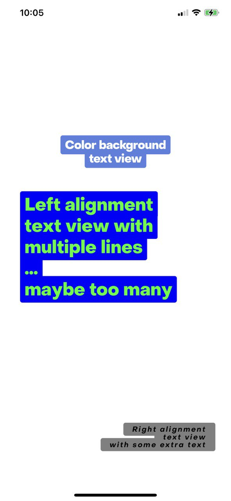
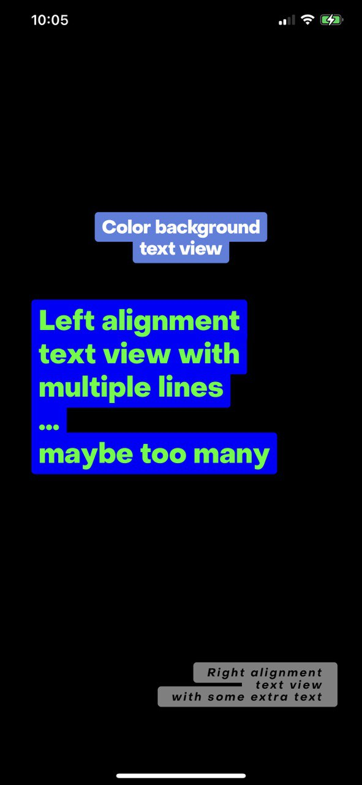

 

Create text views with a colored background. Alignment can also be regulated.

Download this repository to view the code in action. There are demonstrations using programmatically created text views.


## Demonstration

Here's two text view examples:

</img>
</img>

Here's an example on how to programmatically create your own text view (custom fonts permitted):

```swift
// View
let textView = ColorBackgroundTextView()
textView.font = UIFont.systemFont(ofSize: 21)
textView.lineHeight = 23
textView.textAlignment = .center
textView.textColor = .white
textView.color = UIColor(red: 0.349, green: 0.498, blue: 0.878, alpha: 1)
textView.text = "Color background\ntext view"
view.addSubview(textView)

// Constraints
textView.translatesAutoresizingMaskIntoConstraints = false
NSLayoutConstraint(item: textView, attribute: .centerX, relatedBy: .equal, toItem: view, attribute: .centerX, multiplier: 1, constant: 0).isActive = true
NSLayoutConstraint(item: textView, attribute: .centerY, relatedBy: .equal, toItem: view, attribute: .centerY, multiplier: 1, constant: -200).isActive = true
```
